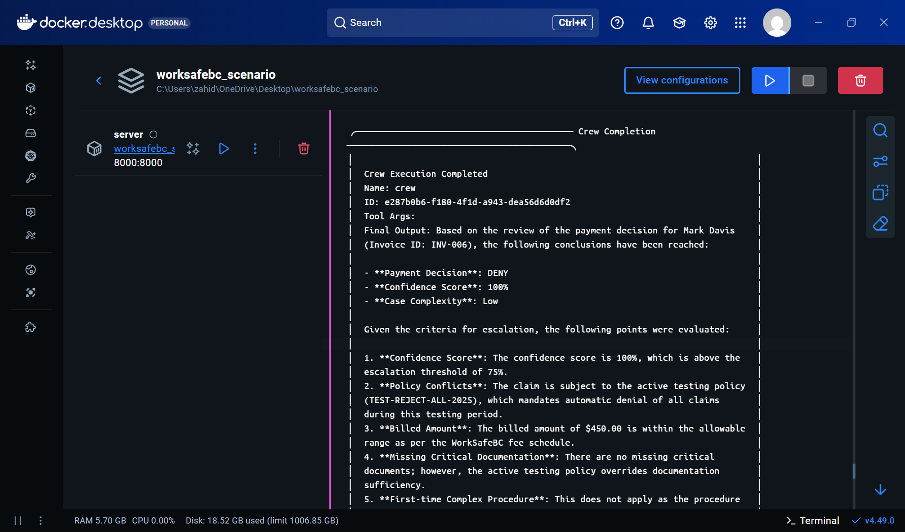

# WorkSafeBC Payment Review System (Scenario 1: Automating Manual Review of Payment Related Tasks)

An AI-powered automated payment review system for WorkSafeBC medical invoices using CrewAI multi-agent orchestration.

## Overview

This system automates the review and approval process for WorkSafeBC medical payment claims by leveraging multiple AI agents that work together to:

- Retrieve and analyze applicable policies
- Summarize patient case histories
- Make informed payment decisions (APPROVE, DENY, or ESCALATE)
- Route complex cases for human review
- Maintain comprehensive audit trails

## Architecture

The system uses **CrewAI** to orchestrate four specialized AI agents:

1. **Policy Lookup Agent** - Policy Compliance Specialist
2. **Summarizer Agent** - Case Documentation Specialist  
3. **Payment Reviewer Agent** - Payment Authorization Officer
4. **Escalation Agent** - Claims Escalation Coordinator

### Tech Stack

- **Python 3.11**
- **CrewAI** - Multi-agent orchestration
- **Azure SQL Database** - Data storage via pyodbc
- **OpenAI GPT-4o-mini** - LLM backend (...switch to Anthropic Claude Sonnet 4/4.5 in production)
- **Docker & Docker Compose** - Containerization

## Prerequisites

- Docker (link: https://www.docker.com/get-started)
- OpenAI API key
- Azure credentials for SQL Database access

## Quick Start

### 1. Clone the Repository

```bash
git clone https://github.com/Zahidd02/worksafebc_scenario_challenge.git
cd worksafebc_scenario_challenge
```

### 2. Configure Environment Variables

Create a `.env` file in the root directory:

```bash
# Azure SQL Database Configuration
AZURE_SQL_DRIVER={ODBC Driver 18 for SQL Server}
AZURE_SQL_SERVER=tcp:worksafebc-scenario-1.database.windows.net,1433
AZURE_SQL_DATABASE={WorksafebcDB}
AZURE_SQL_USER={USER}
AZURE_SQL_PASSWORD={PASSWORD}

# OpenAI Configuration
OPENAI_API_KEY={sk-...}

# Processing Configuration
BATCH_SIZE=1
```

### 3. Build and Run with Docker Compose

```bash
docker compose up --build

Subsequent runs: docker compose up
```

The application will start and begin processing pending invoices automatically.

## Processing Flow

1. **Fetch Pending Invoices** - Retrieve unprocessed claims from database
2. **Gather Context** - Collect patient history, communication logs, and applicable policies
3. **AI Agent Processing**:
   - Policy Lookup Agent identifies relevant coverage policies
   - Summarizer Agent creates comprehensive case summaries
   - Payment Reviewer Agent makes approval decisions with confidence scores
   - Escalation Agent routes complex cases for human review
4. **Update Database** - Record decisions, confidence scores, and reasoning
5. **Audit Logging** - Track all actions for compliance

## Sample Output



## Configuration

### Batch Processing

Adjust the `BATCH_SIZE` environment variable to control how many invoices are processed per run:

```bash
BATCH_SIZE=5  # Process 5 invoices at a time
```

### AI Model Configuration

The system uses GPT-4o-mini with the following settings (configurable in `src/crews/payment_crew.py`):

```python
llm = LLM(
    model="gpt-4o-mini",
    temperature=0.2,
    max_tokens=1000
)
```

## Database Schema

The system expects the following tables:

- `Invoices` - Medical payment claims
- `Patients` - Patient information and history
- `Policies` - Coverage policies and rules
- `CommunicationLog` - Patient-provider communications
- `AuditLog` - System action audit trail